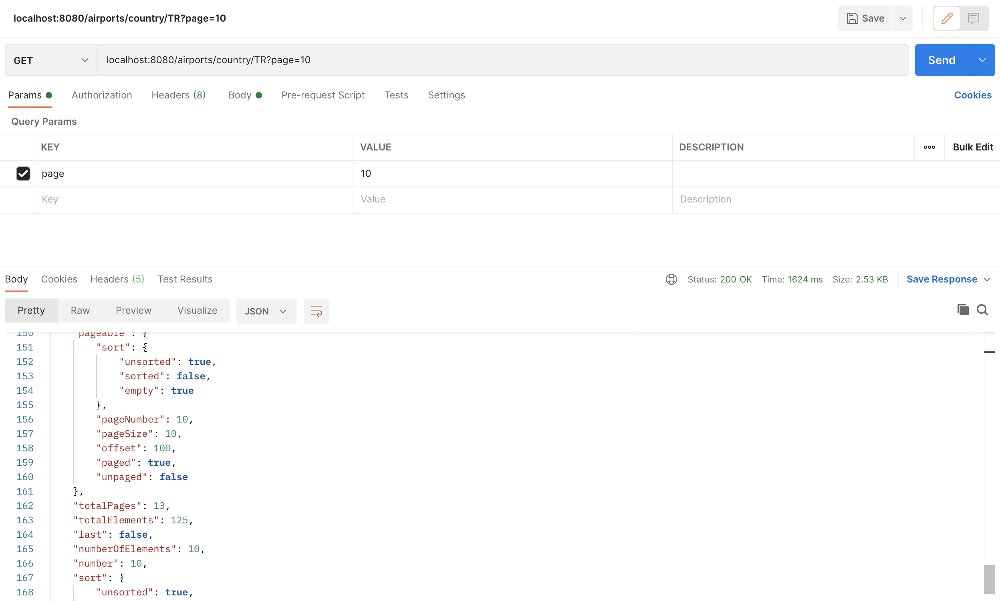
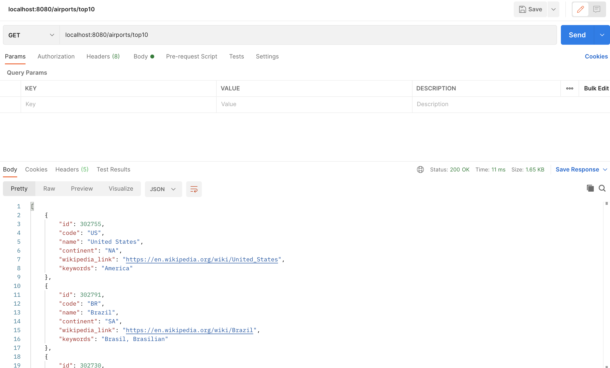

# Coding Challenge

This is the technical test project of Ibrahim AVCI, created for Accenture, based on the requirements defined in TODO.md
file. I used IntelliJ IDE for development. Infrastructure is created over Spring Boot, h2 db and RESTFul services.

#### Building & Running Over Script File with in ease

1. Execute the `./start-up.sh` shell script in the root directory of project in the terminal. This will run maven and
   boot up the application.

2. When the project boot up, project will be immediately load the datasets. I thought It makes sense to have it when we
   initialize the project with given sample data set under resources/csv_files/. CSVFileLoader does that for us.

3. You can call with GET localhost:8080/airports/country/{countryCodeOrName} endpoint to get airports in a given
   country. I implemented with pagination. Because some countries , e.g United States, has hundreds of airports with
   total thousands of runways. So It is important to fetch the data with pagination. If you don't mention page parameter
   in url, it will send first page with default page size in it.
   

4. You can call with GET localhost:8080/airports/top10 endpoint to see the top 10 countries with the highest number of
   airports.
   

# Decisions made

I would like to go with h2 database. Also, I thought h2 database is enough for development usage. You can check the
tables with given link http://localhost:8080/h2-console
For db url is JDBC URL: jdbc:h2:mem:testdb

During the coding challenge I used fastest CSV uploader library called univocity. I tried to cover almost all cases with
my tests.

Regards, Ibrahim AVCI
